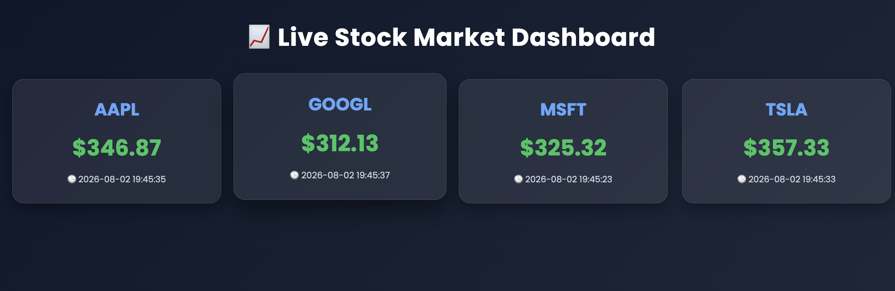
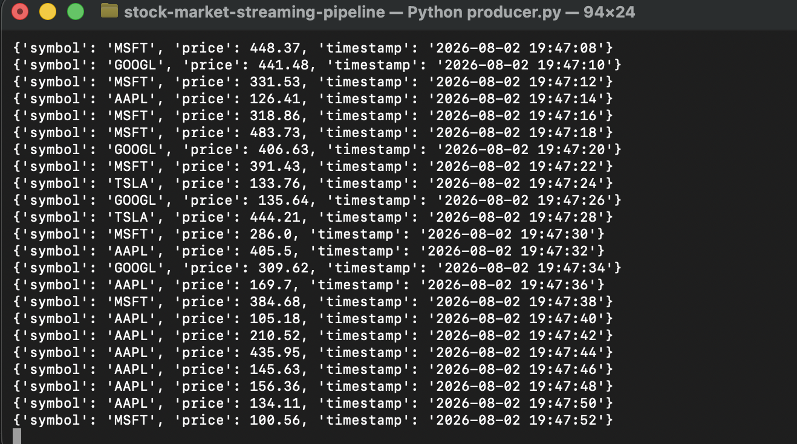
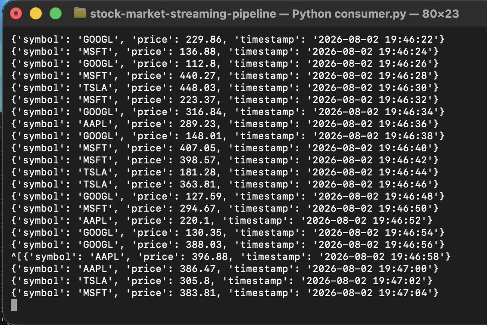
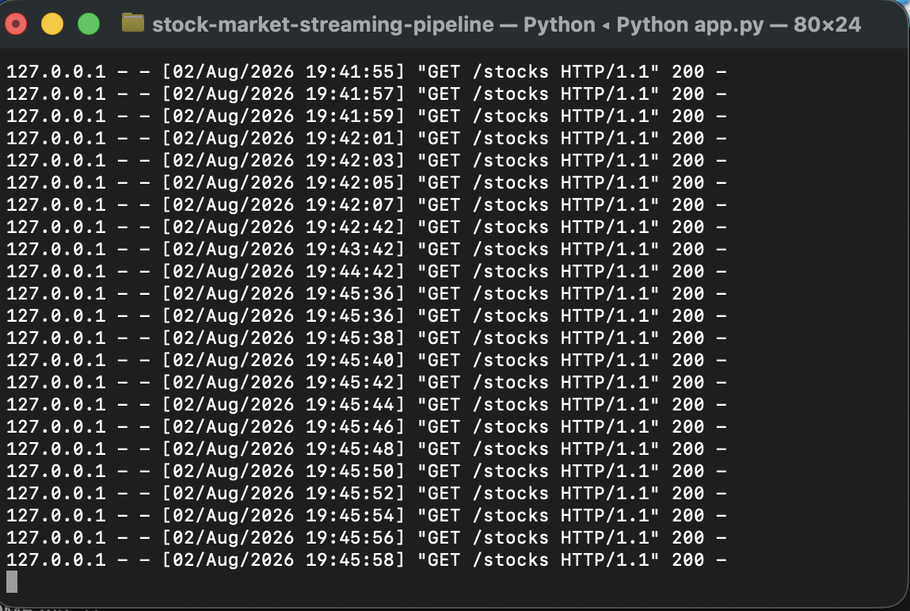

# 📈 Real-Time Stock Market Streaming Pipeline

> A real-time event-driven stock market dashboard built using **Apache Kafka**, **Python**, **Flask**, **HTML**, **CSS**, and **JavaScript**.

<p align="center">


</p>

---

# 🎥 Project Demo

Watch the complete project walkthrough below.

📹 **[▶️ Project Overview Video](assets/demo.mp4)**

---

# 📌 Project Overview

This project demonstrates a **real-time stock market streaming pipeline** using Apache Kafka.

The application continuously generates stock market events, publishes them to a Kafka topic, consumes the latest events using Flask, and displays them on a live dashboard that refreshes automatically every 2 seconds.

It demonstrates the fundamentals of an **event-driven data engineering architecture**.

---

# 🚀 Features

- 📈 Live Stock Market Dashboard
- ⚡ Apache Kafka Producer
- 📥 Apache Kafka Consumer
- 🔄 Real-Time Event Streaming
- 🌐 Flask REST API
- 💻 Responsive Web Dashboard
- 🔁 Automatic Dashboard Refresh (Every 2 Seconds)
- 📦 JSON-Based Message Streaming

---

# 🛠️ Tech Stack

| Category | Technology |
|-----------|------------|
| Language | Python |
| Streaming Platform | Apache Kafka |
| Backend | Flask |
| Frontend | HTML5, CSS3, JavaScript |
| Data Format | JSON |
| Version Control | Git & GitHub |

---

# 🏗️ System Architecture

```text
          Stock Price Generator
                    │
                    ▼
            Kafka Producer
                    │
                    ▼
     Kafka Topic (stock-prices)
                    │
                    ▼
            Kafka Consumer
                    │
                    ▼
             Flask REST API
                    │
                    ▼
         Live Stock Dashboard
```

---

# 📸 Project Screenshots

## 📊 Live Dashboard



---

## 🚀 Kafka Producer

Producer continuously generates stock price events and publishes them to Kafka.



---

## 📥 Kafka Consumer

Consumer subscribes to the Kafka topic and receives live streaming events.



---

## 🌐 Flask Server

Flask exposes the latest stock data through REST APIs consumed by the dashboard.



---

# 📂 Project Structure

```text
stock-market-streaming-pipeline/
│
├── assets/
│   ├── dashboard.png
│   ├── producer.png
│   ├── consumer.png
│   ├── flask-server.png
│   └── demo.mp4
│
├── static/
│   ├── style.css
│   └── app.js
│
├── templates/
│   └── index.html
│
├── app.py
├── producer.py
├── consumer.py
├── requirements.txt
├── README.md
└── .gitignore
```

---

# ⚙️ Installation

### Clone Repository

```bash
git clone https://github.com/YOUR_GITHUB_USERNAME/stock-market-streaming-pipeline.git
```

### Move into Project

```bash
cd stock-market-streaming-pipeline
```

### Create Virtual Environment

```bash
python3 -m venv venv
```

### Activate Virtual Environment

**macOS / Linux**

```bash
source venv/bin/activate
```

**Windows**

```bash
venv\Scripts\activate
```

### Install Dependencies

```bash
pip install -r requirements.txt
```

### Start Apache Kafka

```bash
brew services start kafka
```

### Run Kafka Producer

```bash
python producer.py
```

### Run Flask Application

```bash
python app.py
```

### Open Dashboard

```
http://127.0.0.1:5000
```

---

# 🔄 Data Flow

1. Producer generates stock market events.
2. Events are published to the **stock-prices** Kafka topic.
3. Flask consumes the latest Kafka messages.
4. Flask exposes the data through a REST API.
5. JavaScript fetches updates every 2 seconds.
6. Dashboard displays the latest stock prices in real time.

---

# 📈 Future Improvements

- Live Yahoo Finance API Integration
- AWS S3 Data Lake Storage
- AWS Glue Data Catalog
- Amazon Athena Query Engine
- Docker & Docker Compose
- Real-Time Charts
- WebSocket Streaming
- Power BI Dashboard
- CI/CD with GitHub Actions

---

## ⭐ Support

If you found this project useful, please consider giving it a ⭐ on GitHub.

It helps others discover the project and motivates future improvements.
